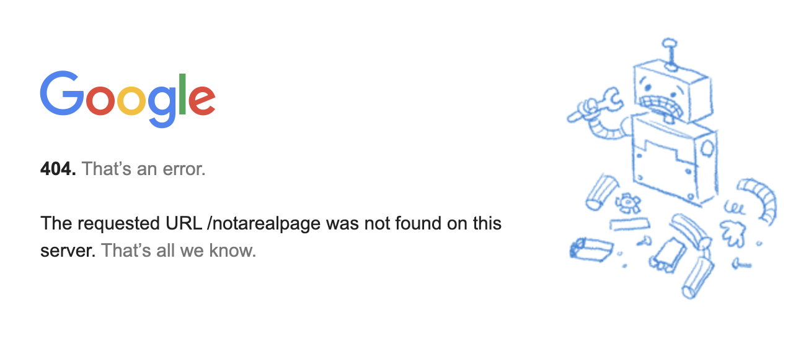

# Conditionals

## Learning Objectives

- Create and evaluate boolean expressions that answer questions about the state of a program's data
- Use `if`, `elif` and `else` keywords to build conditional statements that control the flow of a program 
- Choose among several enumerated possibilities using the `match` & `case` keywords

## Overview

> *"You ever made a decision?"* 
> 
> *"No, I never did that."* 
> -- Joan Didion, *Play It as It Lays*

Earlier on, we introduced the concept of **control flow** in a program as the order in which its lines of code are executed. Our first programs used only the default control flow, wherein lines are executed from top to bottom and only time each. This was sufficient for simple calculations, printing, and programs that made static drawings, but it does not allow for our programs to make any *decisions*. In this chapter, we will apply our knowledge of **boolean expressions** and introduce new control structures in order to write programs that are capable of making choices based on information available to them.


## Conditions & Conditionals

In order to write programs that respond to different situations, we'll need to introduce the concepts of **conditions** and **conditionals**. Conditions are defined as the states of the data in your program. A program's data can include things like values stored inside of variables, information requested from outside sources like the internet, or user input like mouse clicks and button presses. Conditions are defined using **boolean expressions**, or expressions of values and variables that evaluate to a boolean type. You can refer to the chapter on [data types](datatypes.md#booleans) for a refresher on the `bool` type and expressions that produce boolean values.

**Conditionals** are the structures that we use to make decisions based on the conditions that we define. These decisions take the form of questions like: "which of these actions should I take?" or "should I choose to do this next step?" 

An example of a *condition* that you would be aware of as a pedestrian in Philadelphia is whether or not the light facing you at an intersection is currently green. This condition could be true or false—the light might be green, or it might currently be yellow or red instead. The *conditional* that you use in your "walking program" is that if the condition is met; that is, *if the light is green*, then you will cross the intersection. If that condition is not met and the light is not green, then you will wait. 


---

## Conditions as Boolean Expressions

Recall that boolean expressions are expressions that evaluate to `bool` values, i.e. either `True` or `False`. Our first boolean expressions were fairly straightforward and had consistent and predictable results.

```python
3 > 4 and 9 == (81 / 9)                     # always True
not True and True or False and not False    # always False
```

Now that we are familiar with the concept of variables, we are able to write boolean expressions that will produce different results based on the values stored within those variables. For example, without context, it's impossible to evaluate whether the following expression is `True` or `False`:

```python
x % 3 == 2 and x > 5
```

`x`, as a variable, could store any number at all. The result of this expression depends on the value that we've placed in that box. *Can you think of a value of `x` that would cause the expression to evaluate to `True`? What about `False`?*

```python
# What values of x would make this program output True?
# What about False?
x = ??? # Change this line and run the program to experiment.
print(x % 3 == 2 and x > 5) 
```

When we use variables as part of boolean expressions, we are able to test conditions about the state of the world that our program represents. We build these boolean expressions by comparing values with *relational operators* and combining other boolean expressions together with *logical operators.*


### Worked Examples of Writing Expressions to Test Conditions

*"Is the number of tickets sold equal to the capacity for the venue?"* or *"Is the user's password long enough to be valid and is it different from their username?"* are the kinds of useful questions that we can formalize as boolean expressions with variables: sometimes the answers will be "yes" and sometimes "no", all depending on the values stored in the underlying variables.

```python
print("Is the number of tickets sold equal to the capacity for the venue?")
print(num_tickets == venue_capacity)

print("Is the user's password long enough to be valid and is it different from their username?")
print(len(password) >= 8 and password != username)
```

To determine if a password is long enough, we compare the length of the password (`len(password)`) to a fixed minimum length of `8` using the `>=` operator. To check to see if a user's `password` and `username` are different, we use the `!=` ("not-equals") operator to compare them. In order to combine these two smaller boolean expressions into a large one that models our condition, we join the two using the logical `and`: the condition of whether or not a password is acceptable is met if and only if the password is both long enough and distinct from the user's username.

#### One-Way Streets in Center City

In Center City Philadelphia, a numbered street is one-way heading South if its number is even and its number is not 14.[^broad] Try practicing the process of modeling conditions by writing a boolean expression that whether or not a street is one-way heading South: *"Is the given street number even and is its number not 14?"*
To answer this question, we'd need to know the street number. It's not specified in the question, which means that we'll think of it like a variable: `street_number` seems like a suitable name. 

Next, we need to know how to test whether or not a street number is even to build the first part of the boolean expression. A number is considered even if it is divisible by two, and we can test divisibility using the modulo (`%`) operator: `street_number % 2 == 0` is an expression that evaluates to `True` when `street_number` is even.

Then, we have to be able to test if our street number is not 14. Like we did in the password example, we can use the `!=` operator to have a comparison evaluate to `True` when the two values being compared are different. `street_number != 14` evaluates to `True` when `street_number` does not store the value `14`.

Finally, we can build our full condition by combining these smaller boolean expressions together with a logical operator. We want the condition to be `True` *only when* both sub-expressions are `True`; that is, when the street number is even **and** the street number is not 14. This will be a good use of the `and` operator.
```python
street_number = 2 # Change this line and run the program to experiment.
print(f"Does {street_number} Street run one-way south in Center City Philadelphia?")
print(street_number % 2 == 0 and street_number != 14)
```


[^broad]: "14th Street" doesn't actually exist in Philadelphia: we call it Broad Street instead. Furthermore, Broad Street is a two-way street instead of a one-way.

<!-- # The Boolean Expression Toolkit

#### Relational Operators
| Operator/method | Input Types                | Description                                    |
| --------------- | -------------------------- | ---------------------------------------------- |
| `<` / `<=`      | `int` & `double`           | less than / less than or equal to              |
| `>` / `>=`      | `int` & `double`           | greater than / greater than or equal to        |
| `==` / `!=`     | `int`, `double`, `boolean` | equal to / not equal to                        |
| `.equals()`     | `String`                   | equal to                                       |
| `.compareTo()`  | `String`                   | returns -ve, 0, or +ve `int`, not a `boolean`! |

---

# The Boolean Expression Toolkit

#### Logical Operators
| Operator/method | Input Types | Description                                                               |
| --------------- | ----------- | ------------------------------------------------------------------------- |
| `&&`            | `boolean`   | logical "and", evaluates to `true` only if both inputs are `true`         |
| `\|\|`          | `boolean`   | logical "or", evaluates to `true` as long as at least one input is `true` |
| `!`             | `boolean`   | logical "not", negates a single `boolean` value to its opposite           |

---

# Truth Tables

| P       | Q       | P && Q  | P \|\| Q | !P      |
| ------- | ------- | ------- | -------- | ------- |
| `true`  | `true`  | `true`  | `true`   | `false` |
| `false` | `true`  | `false` | `true`   | `true`  |
| `true`  | `false` | `false` | `true`   | `false` |
| `false` | `false` | `false` | `false`  | `true`  | --> |

## Conditionals: `if`, `elif`, and `else`

**Conditionals** allow us to control the flow of a program based on conditions defined using the values in the program. Conditionals are defined in Python using three special keywords: `if`, `elif`, and `else`. We will start by introducing the `if` statement.

### The `if` Statement

> *"`if` music be the food of love, play on."* — William Shakespeare
>

Whereas before we executed all lines of code in the program from top to bottom, our first conditional—the `if` statement—will allow us to specify a portions of our program that should be run only if a certain corresponding conditions are met. We can understand the behavior of `if` statements by examining the flow chart below:


On reaching the `if` statement, we test a condition. If that condition is `True`, then we execute the corresponding statement or block of statements. If the condition is `False`, then we skip over all corresponding statements and resume program execution at the first line of code following the skipped statements. The motto to remember when you see a single `if` statement is: *"I am now choosing whether or not to do something."*

The `if` statement is built using the `if` keyword, a boolean expression followed by a colon (`:`) and a body of statements indented one level further than the line with the `if`. The structure for such a statement looks like this:

```python
if my_boolean_expression:
	statement_one
	statement_two
	...
	statement_last
```

For example, perhaps we want to write a program that helps us determine whether or not a variable `num` is divisible by `5`. We can start by assigning `num = 10` and observing the result.

```python
num = 10
print("Printing a message if {num} is divisible by 5...")
if num % 5 == 0:	# if, followed by our boolean expression defining the condition
	print("Yes!")	# the statement to be executed if condition is met
```

When the program is run, we get the following output:
```console
Printing a message if 10 is divisible by 5...
Yes!
```

Success! Since `10` is divisible by `5`, our boolean expression `num % 5 == 0` evaluates to `True`: our condition is met. So, we evaluate the statements in the indented block following the line with `if`. In this case, that is a single line: `print("Yes!")`. Our output consists of two printed lines.

We could change the value of `num`, thereby changing the state of our program, and observe the result.

```python
num = 11	# Trying again but changing 10 --> 11
print("Printing a message if {num} is divisible by 5...")
if num % 5 == 0:	# if, followed by our boolean expression defining the condition
	print("Yes!")	# the statement to be executed if condition is met
```

When the program is run, we get the following output:
```console
Printing a message if 10 is divisible by 5...
```

Only one line is printed! The condition is not met—`num % 5 == 0` evaluates to `False` this time—and so we skip all statements in the indented block. Remember: with an individual `if`, you are *choosing whether or not to do something*.

The indented blocks that you find underneath each of the `if` statements define the lines of code that will only be executed when the specified condition is met. Once we leave an indented block that makes up the body of an `if` statement, we return to executing statements without consideration for the truth value of the condition. 

```python
print("I like to eat apples.")
if 5 // 2 == 2.5: # remember, // means integer division!
	print("I like to eat bananas.")
print("I like to eat cherries.")
```

Inspecting the example above, we see three print statements in total. Two are totally *unconditioned*, meaning that they are not part of the body of any conditional statements. We will reach the first print statement and print the message about apples. Then, we reach our `if` statement. Recall that integer division `//` always produces an `int` value with any fractional result of the quotient truncated away, and so `5 // 2` evaluates to `2`, not `2.5`. The conditional's boolean expression evaluates to `False`, and so the print statement inside that `if` statement is skipped. We can see that line 4 is not a part of the indented block, and so it is the first line of code that will be run after skipping the previous conditional. The output is thus:

```console
I like to eat apples.
I like to eat cherries.
```

It's possible to include multiple `if` statements in the same program, and when we do, we consider each of their conditions independently. Recall our definition of a strong password from before: passwords are strong if they are at least eight characters long and they are distinct from the user's username. We wrote one single boolean expression to define this condition in the first case, but suppose we wanted to write a program that could give us some feedback about *why* a password isn't any good. We might write the following:

```python
username = "inspector_norse"
password = "0451"
if len(password) < 8:
	print("Bad Password: Not long enough!")
if password == username:
	print("Bad Password: Same as username!")
```

Running this program gives the following output:

```console
Bad Password: Not long enough!
```

Only one of the messages is printed. After defining our two variables, we reach our first conditional on line 3 and test the relevant condition and find that the password has a length less than eight characters. Entering the body of that conditional, we print the appropriate warning, and then we reach the end of the indented block of statements. That means that we proceed to the next statement *unconditionally* and process it. That next statement is the next conditional found on line 5. We test its condition and find that the `password` and `username` are different and so we skip the indented block of statements that make up the body of the `if` statement. This brings us to the end of the program, and there's nothing else to do.

As an exercise, you should try to change the value of `password` to another string so that the program exhibits both of the following behaviors. 
- The program prints out only the message `"Bad Password: Same as username!"` when run.
- The program prints out no messages at all when run.

Finally, can you explain why it is not possible to change only the value of `password` and have the program print out both warning messages? What would you need to change about the program to make it possible to do so?

#### Nesting `if`s

Although they look slightly different than print statements or variable declarations, conditionals are just statements like any other. This means that they can be part of the bodies of other conditionals, since these indented blocks just comprise more statements. Consider the following program, `days_in_month.py`:

```python
month = 8 # change this value & see what gets printed
if month <= 7:
	if month % 2 == 1:
		print(f"Month {month} has 31 days.")
	if month % 2 == 0 and month != 2:
		print(f"Month {month} has 30 days.")
	if month == 2:
		print(f"Month {month} has 28 days.")
if month > 7:
	if month % 2 == 1:
		print(f"Month {month} has 30 days.")
	if month % 2 == 0:
		print(f"Month {month} has 31 days.")
```

At our top level, we have a variable declaration followed by our first conditional which tests if the provided `month` is at most seven. If it is, then it is the odd numbered months that have 31 days and the even numbered months that have 30 days—except for month 2, February, which has 28 days [most of the time.](datatypes.md#example-leap-years). These three conditions are tested if and only if `month <= 7` happens to be `True`, and you can observe that dependency by noting that each of the following three `if` statements are indented one level to the right of that initial conditional. The corresponding print statements are indented one level further under each of the corresponding `if` statements, indicating that each message will be printed only in the case that the parity and value conditions are met. After the third nested `if` statement and its body, we return back all the way to the left with our next conditional, testing whether `month > 7`. If it's a month after July, then it's the odd months that have 30 days, and the two nested conditionals match these conditions to the appropriate outputs. 

### The `elif` Statement

The `if` statement allows us to make a simple binary choice: to do, or not to do? Moreover, each `if` that we place in our program is considered independently so that we might execute any number of the statements based on the truth values of their conditions. Sometimes, we might want a succinct way of choosing one option among a number of different options. The `elif`—"el if" or "else if" when read aloud—keyword allows us to do that. The syntax of an `elif` statement is functionally identical to that of an `if` statement, but it cannot be used without a preceeding `if` statement to accompany it. Here's a general example of how an `elif` statement looks accompanying an `if` statement. 

```python
if first_boolean_expression:
	statement_one
	statement_two
	...
	statement_last
elif alternative_boolean_expression:
	statement_a
	statement_b
	...
	statement_z
```

The purpose of the `elif` statement is to specify a block of code that can only be run if no previous condition in the chain has been met. In this way, we say that `if` and `elif` statements represent *mutually exclusive* choices: we may execute the body of one, the other, or neither, but *never both*.

Perhaps we want to write a program to make a decision for today's activities based on the day's temperature.

```python
temperature = 90
if temperature > 85:
	print("Go to the beach. 🏖️")
elif temperature > 55:
	print("Go hiking. 🥾")
```

When we have `temperature = 90` as the first line of this program, the output looks like the following:

```console
Go to the beach. 🏖️
```

Notice that although both boolean expressions written in the program (`temperature > 85` and `temperature > 55`) would evaluate to `True`, only one body of statements was triggered by the conditional structure. This is due to the mutually exclusive properties of `if` and `elif`: when the first condition was met, we executed the statements in the body of the `if` statement and then skipped the `elif` statement entirely.

If the weather had been a bit more reasonable and we had `temperature = 64` as the first line of our program instead, the printed output would have been the following:

```console
Go hiking. 🥾
```

In this case, since the first condition was not met, we were able to test the second one that belongs to the `elif` statement. This condition is indeed met, and so we execute the statements in the body of the `elif` statement.

It is also possible to have both boolean expressions evaluate to `False`, in which case the program would print out nothing. Try changing `temperature` to store a colder value and verify this for yourself. 

A nice feature of `elif` statements is that they can be chained together one after the other to create a series of mutually exclusive conditions that will be tested in order from top to bottom. We might write a program to assign letter grades based on point values for an exam, for example:

```python
exam_score = 94
letter_grade = "F"
if exam_score > 90:
	letter_grade = "A"
elif exam_score > 80:
	letter_grade = "B"
elif exam_score > 70:
	letter_grade = "C"
elif exam_score > 60:
	letter_grade = "D"
print(f"Your exam score of {exam_score} earns: {letter_grade}.")
```

In this program, we find an `if` statement followed by four different `elif` statements. Notice that each of these defines a new boolean expression that will only be tested if all of the previous conditions in this chain evaluated to `False`. The program as listed with `exam_score = 94` will cause the very first expression to be `True`, and so `letter_grade` will be set to `"A"`. Since that first expression was `True` and all other expressions correspond to `elif` statements, all other conditions in that conditional chain are skipped. When we run the program as written, we get the following output:

```console
Your exam score of 94 earns: A.
```
The use of `elif`s here is very important to making sure the program behaves correctly. Consider what would have happened if we had used a series of `if` statements instead of an `if`-`elif` chain:

```python
exam_score = 94
letter_grade = "F"
if exam_score > 90:
	letter_grade = "A"
if exam_score > 80:
	letter_grade = "B"
if exam_score > 70:
	letter_grade = "C"
if exam_score > 60:
	letter_grade = "D"
print(f"Your exam score of {exam_score} earns: {letter_grade}.")
```

The printed output is:

```console
Your exam score of 94 earns: D.
```

When we test the first expression on line 3, it evaluates to `True` and so we set `letter_grade = "A"`. But then, since it's not guarded by an `elif`, we also test the expression on line 5 and find it to also be `True`! This causes the program to set `letter_grade = "B"`. The problem is repeated on line 7 and line 9, and so finally we set `letter_grade = "D"` and then get the incorrect output printed. If we had wanted to write this program correctly using only `if` statements and no `elif` statements, then we would need to be more specific about our conditions. The `elif` statements allow us to assume that by getting to line 5, for example, that we already know that `exam_score > 90` is `False`, since if it were `True`, we would skip this test. The condition on line 5 is therefore implicitly testing whether `exam_score` is both *at most 90 and greater than 80.* The version of this program using only `if` statements that is equivalent to the original `elif` version looks like the following:

```python
exam_score = 94
letter_grade = "F"
if exam_score > 90:
	letter_grade = "A"
if 90 >= exam_score > 80:
	letter_grade = "B"
if 80 >= exam_score > 70:
	letter_grade = "C"
if 70 >= exam_score > 60:
	letter_grade = "D"
print(f"Your exam score of {exam_score} earns: {letter_grade}.")
```

#### Writing Multiple Conditional Chains

Each time we write an `if` statement, we are breaking the previous conditional chain. Every `elif` statement provides an option that will only be tested when all previous corresponding `if`-`elif` conditions were not met *up until the most recent previous `if` statement.* 

```python
transaction_completed = False
if account_balance < item_price:
	print("Insufficient funds to complete transaction. Transaction cancelled.")
elif account_balance > item_price:
	transaction_completed = True
	print(f"Completing transaction; dispensing change amount of {account_balance - item_price}")
elif account_balance == item_price:
	transaction_completed = True
	print("Completing transaction. Have a nice day.")

if transaction_completed and item_price > 10.00:
	print("Printing $2.50 coupon for your next visit.")
elif transaction_completed and item_price > 5.00:
	print("Printing $1.00 coupon for your next visit.")
```

In the example above, we  compare the `account_balance` to the `item_price` and choose one of the options—reject the transaction due to insufficient funds, complete the transaction and dispense change, or complete the transaction without dispensing change.[^min_one] In both of the latter two cases, we also set `transaction_completed = True` to model that the item was indeed sold. Then, separately, we check if the transaction was completed and if `item_price` was either greater than $10.00 or between $10.00 and $5.00 in order to dispense a coupon for the customer's next visit. We will only dispense one of those coupons at most, and in the case that `transaction_completed` stores the value `False`, then we won't dispense any of the coupons.

[^min_one]: Even though it is generally possible to reach the end of a conditional chain comprised of `if` and `elif` statements without having any of the conditions along the way being met, in this case we will always trigger one of them. Can you see why? 

### The `else` Statement

Let's circle back for a moment to our earlier activity planning example:

```python
temperature = 90
if temperature > 85:
	print("Go to the beach. 🏖️")
elif temperature > 55:
	print("Go hiking. 🥾")
```

In this case, we have two conditions that might be met, but it is possible to modify the value of `temperature` so that neither of the boolean expressions written evaluate to `True`. We could have provided a default "stay inside and read" outcome by specifying a condition for temperatures that are too cool for a pleasant outdoor activity using `elif` statements:

```python
temperature = 30
if temperature > 85:
	print("Go to the beach. 🏖️")
elif temperature > 55:
	print("Go hiking. 🥾")
elif temperature <= 55:
	print("Read a book. 📖")
```

Now, our conditional structure covers all possible `int` values: the temperature will be above 85, or above 55 but not above 85, or it will be 55 or below. Unfortunately, it takes a bit of reasoning to prove that this conditional will have one of its branches triggered. It is often convenient to specify a default outcome for a conditional without having to come up with a boolean expression of your own that captures all other possible outcomes excluded by the other branches. Python allows us to do this with the last component of a conditional statement: the `else` clause. 

The `else` keyword allows us to define a body of statements that will be run only in the case that all previous conditions were not met. There is a small syntactical difference in writing `else` statements compared to `if` and `elif`: they are not written with a new boolean expression to accompany them. The condition to execute the statements belonging to an `else` is exactly that *all previous expressions in the conditional evaluated to `False`.* Inspect the syntax for a full Python conditional chain below:

```python
if first_boolean_expression:
	statement_one
	statement_two
	...
	statement_last
elif alternative_boolean_expression:
	statement_a
	statement_b
	...
	statement_z
# optionally many elif statements provided here
else:
	default_statement_one
	default_statement_two
	...
	default_statement_last
```

Finishing a conditional with `else` guarantees that at least one block of statements in the chain will be executed. `else` statements *cannot* be written with a boolean expression, and the condition that they implicitly represent is the negation of all previous conditions.

#### Nesting with `elif` and `else`

Being a part of conditional statements, `elif` and `else` statements can be found nested within the bodies of other conditionals. The indentation of the block indicates which conditional the `elif` and `else` statements correspond to. 

```python
if am_hungry:
	if is_morning:
		print("Making pancakes! 🥞")
	else:
		print("Making soup! 🍜")
```

The `else` in the example above is aligned with the second `if`, testing whether or not `is_morning` is `True`. It is possible for this program to print nothing at all if `am_hungry` is `False`, but if `am_hungry` is `True`, then we will evaluate the statements in the body of the outer conditional. Those statements include that `if`-`else` pair that choose which one of the two meal options to print out depending on the value of `is_morning`. If I am hungry, I will make something to eat (and my choice will be printed). If I am not hungry, I will do & print nothing at all.

If the `else` had been moved out of that indented block, then it would provide the alternative condition for the first `if` instead, leading to a fairly nonsensical program:

```python
if am_hungry:
	if is_morning:
		print("Making pancakes! 🥞")
else:
	print("Making soup! 🍜")
```

Now, if I'm hungry and it's morning, I'll make some pancakes—perfectly reasonable. But if I'm hungry and it's not morning, I won't eat! Not good. Perhaps even more perplexing: if I'm not hungry, then by default I'll make soup. To prevent such deranged behavior, keep in mind that in Python, the indentation of `elif` and `else` statements indicate to which conditional chains they belong.


### Summary of Conditional Structure

A conditional statement consists of one essential part—the `if`—and several optional parts.

1. Conditionals always begin with an `if` statement. The `if` statement must include a boolean expression to test.
2. Optionally, conditionals may include any number of `elif` statements. Each `elif` statement must include a boolean expression to test. Any conditional may include zero or more `elif` statements. Each `elif` statement is tested only if all previous `if` and `elif` statements had their expressions evaluate to `False`.
3. Optionally, include an `else` statement. The `else` statement does not include a boolean expression to test. Any conditional may include zero or one `else` statements. The body of the `else` statement is only executed if all previous `if` and `elif` statements had their expressions evaluate to `False`.

## Patterns & Making Matches

### Programming Patterns

As we start to develop our programming skills and introduce more features in Python, we'll find increasingly often that there are several ways to express the same *programming logic* with different *syntax features*. For one example, we can think of a simple nested `if` as being the same as a logical `and`. Consider the following snippets:

```python
# One if, two boolean expressions joined by "and"
if day == "Sunday" and 17 >= hour >= 22:
	print("Go eat at Lauder!")

# Two ifs, two boolean expressions at two levels
if day == "Sunday":
	if 17 >= hour >= 22:
		print("Go eat at Lauder!")
```

Both are ways of expressing the same idea but with different "spellings." Both conditionals will print the same message for exactly the same values of the two variables. In programming languages and software design, we have the concept of a programming **pattern**, which is a frequently-used bit of code design that is recognizable in its purpose. By learning to recognize patterns, you will be able to quickly understand the purpose of a piece of code without having to think so hard about it. Additionally, patterns are useful when writing code since they can be quickly deployed as a solution to a common problem you're working on. 

### `case` and `match` in Python

Conditionals are the most common tools that we'll use for decision making in our Python programs. They are the most useful because they are fully customizable: they accept any boolean expression as a condition. Since conditionals can take any expressions as their conditions, though, it can be a bit challenging to reason about the purpose of a conditional chain: *What are the conditions supposed to represent? What are the mutually exclusive conditions? What are the implications of putting the conditions in the given order?* In this section we'll introduce a feature of Python called **pattern matching**, which allows us to express a common conditional pattern with a more succinct syntax.

We can write a conditional to model the behavior of a responsible driver by comparing the current state of a traffic light to the set of its three possibilities: red, yellow, and green.

```python
if traffic_light == "red":
	print("Stop!")
elif traffic_light == "yellow":
	print("Slow down.")
elif traffic_light == "green":
	print("Proceed carefully.")
```

To someone reading our code later, they will observe several independent conditions and have to reason about their behavior indepedently before being able to recognize that we are just *matching* on the different possible *cases* that the `traffic_light` variable might store. Python provides the `match` and `case` keywords so that we can specify the variable that we're comparing against just one time. Here is a program that behaves in exactly the same way:

```python
match traffic_light:
	case "red":
		print("Stop!")
	case "yellow":
		print("Slow down.")
	case "green":
		print("Proceed carefully.")
```

After the `match` keyword, we provide the value that we want to compare to. Then, we list a number of different `case`s, each with its own corresponding block of code that is run when the value being matched on takes that specific value. This example and the previous one behave in exactly the same way, but by using `match`, we signal to anyone reading our program what the purpose of this snippet is. In this way, we are using `match` as a pattern for selecting which outcome we desire based on a specific value of `traffic_light`.

#### Example: HTTP Status Codes

For the next example, we'll be using discussing HTTP Status Codes. **HTTP** is short for "**H**yper**t**ext **T**ransfer **P**rotocol", which is the name for the system of rules we use to send information through the internet when loading webpages. Whenever you try to load a webpage on the internet, you're asking a server for the information required to display that page in your browser. Most of the time, this just works: you receive the content of a webpage (the text and links and images on that page) and your browser shows it to you as a nicely rendered page. But sometimes, things go wrong. Servers can go offline, or the URL that you requested might have a typo in it. Perhaps you've encountered a "404 Not Found" error page before when you've tried to navigate to a link that doesn't exist.



Whenever your browser gets a response from the page load under the HTTP protocol[^redundancy], that response includes a "status code" that tells your browser how to interpret its contents. Here's a brief table of those codes:

| Status Code | Name                  | Meaning                                                                          |
| ----------- | --------------------- | -------------------------------------------------------------------------------- |
| `200`       | OK                    | "The request worked, here's the page you wanted."                                |
| `301`       | Moved Permanently     | "What you were looking for has been moved, but here's the link to the new spot." |
| `403`       | Forbidden             | "You're not allowed to see what you asked for."                                  |
| `404`       | Not Found             | "What you're asking to see doesn't seem to exist."                               |
| `500`       | Internal Server Error | "Something went wrong. Sorry!"                                                   |

We could write a `match` statement to help us parse out the `status` code we receive from an HTTP response:

```python
match status:
	case 200:
		print("The request worked, here's the page you wanted.")
	case 301:
		print("What you were looking for has been moved, but here's the link to the new spot.")
	case 403:
		print("You're not allowed to see what you asked for.")
	case 404:
		print("What you're asking to see doesn't seem to exist.")
	case 500:
		print("Something went wrong. Sorry!")
```

One nice additional feature of pattern matching in Python is that we can merge multiple cases together using the `|` operator. If we wanted to make the previous code provide messages that are a bit more general, we could do it like so:

```python
match status:
	case 200:
		print("The request worked, here's the page you wanted.")
	case 301:
		print("What you were looking for has been moved, but here's the link to the new spot.")
	case 403 | 404:
		print("You asked for something you can't have.")
	case 500:
		print("Something went wrong. Sorry!")
```

In this case, if `status == 403` or `status == 404`, then the same message of `"You asked for something you can't have."` is printed.

We can also mimic the `else` functionality of a conditional statement by using a *default case* using the `_` ("underscore") character. We could make our matching complete by providing a default case for all of the other status codes that we don't have individual matches for:

```python
match status:
	case 200:
		print("The request worked, here's the page you wanted.")
	case 301:
		print("What you were looking for has been moved, but here's the link to the new spot.")
	case 403 | 404:
		print("You asked for something you can't have.")
	case 500:
		print("Something went wrong. Sorry!")
	case _:
		print("Something complicated happened.")
```

With this implementation, if `case` is not equal to any of `200`, `301`, `403`, `404`, or `500`, then the default message of `"Something complicated happened."` will be printed.

Using `match` in Python actually provides quite a large number of other case definitions that you can use. We will touch on some of these later.


[^redundancy]: I know I just wrote "Hypertext Transfer Protocol protocol", but I think "the HTTP protocol" is nicer to read than "the HTTP". Please send all comments and complaints to `sharry@seas.upenn.edu` 👍.