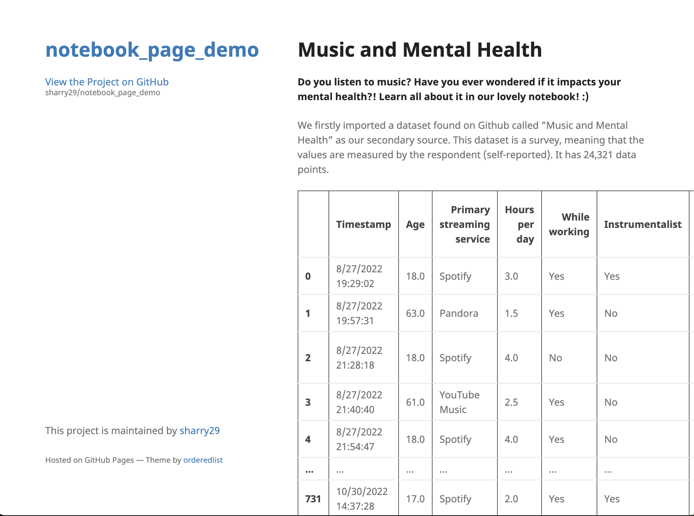
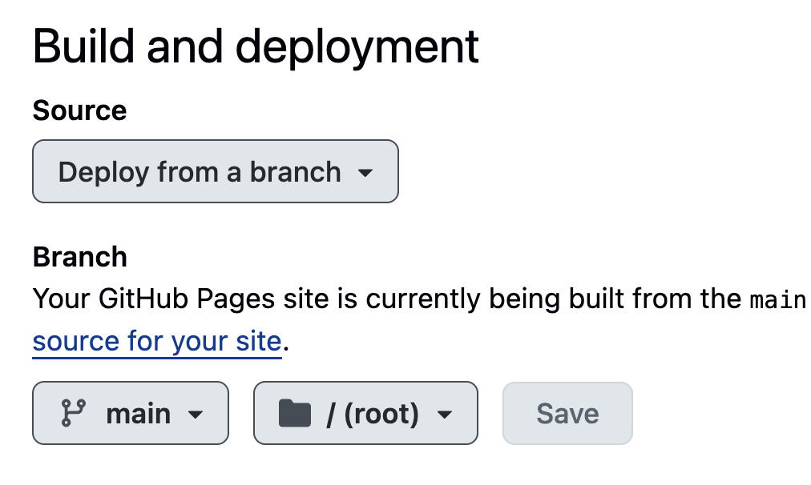
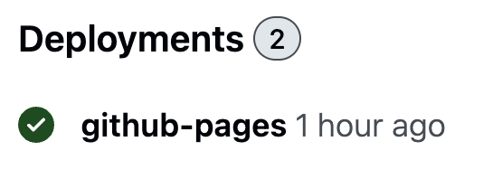

# Publishing Notebooks

*For this activity, we will assume that you already have a way of writing your Jupyter Notebook. If you want to write a Notebook and you don't have access to an environment, the simplest way to do so will be to [install Python](https://littlecolumns.com/tools/python-wrangler/) and then use [VSCode](https://code.visualstudio.com/docs/datascience/jupyter-notebooks) for editing.*

## Converting Your Notebook

We'll use Jupyter's built-in `nbconvert` tool to automatically convert our notebook to different formats. There are a couple of approaches we can use here, depending on how obsessive we want to be about the style of the output.

### Option 1: Jupyter Style

This option requires the least fussing around. It creates an HTML render of your notebook following basic Jupyter notebook stylings. If you create the page this way, anyone who knows what Jupyter Notebooks are will be able to recognize that your site was created directly from a notebook. That's not a problem, but it does deprive you of an 🪄 *air of mystery* ✨.

Anyhow, here's what you type in the terminal to get this to work. Make sure to replace that last bit with the name of your actual notebook!

```bash
jupyter nbconvert --to html --output index.html --no-input <your_notebook_name>.ipynb
```
- `jupyter nbconvert` is the main command to convert your notebook
- `--to html` specifies that we want to create HTML for a web page
- `--output index.html` guarantees that the output has a filename that makes navigating to your page simple
- `--no-input` skips all of your code in the output HTML and includes only your text and outputs. For sharing *results*, this is usually what you want. (You can always add a link to your notebook file in the HTML so that people can see how you did what you did.)

You should see a new file created: `index.html`. This will be the only thing you need to upload in the next step.

### Option 2: Following Jekyll Themes

Jupyter styling is designed to support figures, a little bit of text, and enormous DataFrame readouts. It is often the case, though, that those big DataFrames are not actually very important for your readers; instead, you'll just focus on the figures and text. 

In this case, we'll export the notebook to Markdown first. Markdown is a format used for lightweight editing of structured & marked up text, and it is interoperable with HTML. If we create a Markdown version of our notebook, we can make edits much more easily. This is a good opportunity to take out the big DataFrames & the other outputs that aren't important or to write new explanations. 

To convert your notebook to markdown, run the following:

```bash
jupyter nbconvert --to markdown --output index.md --no-input <your_notebook_name>.ipynb
```

You should see that a new file (`index.md`) and a new directory (`index_files`) have been created. You will need to upload **both** of these things in the next step. 

Take a moment to create a new file called `_config.yml` (yes, including the underscore at the beginning) that contains just the following line:

```yaml
theme: jekyll-theme-minimal
```

This will cause your webpage to be displayed with custom style rules. It makes your notebook look quite elegant, but only if you can remove all of your very wide DataFrame outputs. If it's important for your discussion to include these wide DataFrames, consider using [Option 1](#option-1-jupyter-style).

Here's what it looks like for text & a figure. Pretty good!


Here's what it looks like with a big ol' DataFrame. Less good.



## Hosting Your Project

We'll use GitHub Pages for this. You'll need to:

1. Create a GitHub account
2. Create a new repository on github.com and make sure that it's set to be **public**.
3. Go to the settings of your repository by clicking the gear icon. Navigate to the "Pages" section in the list on the left.
4. Enable GitHub Pages. Set the Source and Branch as follows.



Finally, independent of the option that you chose earlier, navigate back to the "Code" tab of your repository, press the "+" (Add File) button, select "Upload Files", and upload all of the files created by `nbconvert`. Then, after waiting a few minutes, you can see your "Deployments" in the bottom right. Click that link to find the URL for your page, which you can then preview. Tada! 🎉



To make any changes, simply edit the corresponding files in the GitHub editor. You can do that by opening the file and selecting the pencil icon for editing. There are also other [themes](https://pages.github.com/themes/) you can try if you picked [option 2](#option-2-following-jekyll-themes) above.