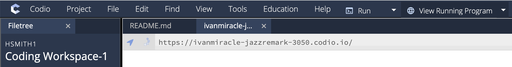

# PennDraw

As we move beyond `hello_world.py` and printing text, we will begin to write programs for drawing images and animations. We want you to get more comfortable with both reading and writing programs, and computational art is a good place to start. It allows us to get familiar with writing programs where each line executes an individual instruction that has a visible effect. You will learn to reason about the behavior of existing code and you will be able to actually *see* the effects that result from changing or adding lines of code to an existing program.

We will start in this section by discussing concepts that are generally important for computational drawing: the canvas, coordinates, drawing settings, and screen ordering. After that, we’ll learn how to write code in Python that uses PennDraw to make our own drawings. PennDraw is the name of a group of related drawing tools available for you to use. Any time we need to draw to the computer’s screen in CIS 1100, we’ll use PennDraw.

You can access a full listing of PennDraw’s features on the [PennDraw Documentation](#) (LINK TKTKTK) page of the course website. This will be important for completing HW00. For now, we’ll step through some basic principles of drawing through programming.

## Importing PennDraw

PennDraw is a **library** of programs written in Python but it does not come pre-installed with Python. PennDraw can be used in Python programs, but since PennDraw and Python are two separate pieces of software, we need to manually identify PennDraw as a library we want to use. We do this by **importing** PennDraw. Import statements, marked by the `import` keyword, signal to Python that we will be using code from an outside library in our program. In order to import PennDraw, all we need is the following line at the top of our code file:

```python
import penndraw as pd
```

In this case, the name of the library is `penndraw`—all one word, all in lowercase letters. Since we're going to be using code from this library very frequently, it will be helpful to give the name an abbreviation.  We specify the abbreviation `pd` by writing `as pd`. This is very common practice in Python programs: popular libraries like `numpy` or `pandas` are often abbreviated to `np` and `pd`, respectively.[^abbrev] Altogether, with this one line of code, we tell Python to make the `penndraw` library available to us under the name `pd` when we want to use it.

## The Canvas & Coordinate Systems

### The Canvas

The *canvas* refers to the window of space on which PennDraw can do its drawing. It has a width and a height, both defined in pixels. We usually express the size of the canvas as *"width x height"*.

> If a canvas has dimension 800x400, then we say it has a width of 800 pixels and a height of 400 pixels, and it would look like this:  
> 
> 

The dimension of the screen going from left-to-right (along the width) is called the *x dimension*. The up-and-down direction (along the height) is called the *y dimension*. This keeps us consistent with conventions in mathematics.

### Coordinate Systems

Although it’s important to keep in mind that the canvas has dimensions expressed in pixels, PennDraw allows us to define coordinates on the screen however we’d like. *By default, the coordinates of a canvas range from 0 to 1 in both the x dimension and the y dimension.*
Thus, the coordinate `(0, 0)` refers to the bottom left position of the canvas. Coordinate `(1, 1)` is found at the top right of the canvas. 


For most of the work that we do in this course, we will keep the coordinate system set in the range from 0 to 1. You should get used to referring to screen positions in this way. Here are a few important things to understand about this coordinate system:
- The "origin" is the bottom left of the canvas.
- Larger values of x coordinates refer to positions further to the right.
- Larger values of y coordinates refer to positions higher up.
- Negative coordinates or coordinates with values greater than 1 are technically valid but refer to positions not visible on the canvas.

Sometimes it also makes sense to discuss the height and width of shapes instead of just the positions of points. We can refer to these dimensions in coordinate space as well. For example, a horizontal line spanning between the left side of the canvas `(x is 0.0)` and the center point of the canvas `(x is 0.5)` would have a *coordinate width* of `0.5` since its width would be exactly half of the screen. 

### Relating Coordinates to the Canvas (Example)

First, we can set up a canvas of square dimensions, setting the width and height to the same number of pixels. Then, we can draw a rectangle with its top left vertex at `(0.1, 0.8)` and its bottom right vertex at `(0.5, 0.6)`. The resulting image would look like this:


In this example, the following are true:
- The rectangle has a *coordinate width* of `0.4`; that is, the distance in coordinate space between the right side of the rectangle at `0.5` and the left side of the rectangle at `0.1` is `0.4`.
- The rectangle has a *coordinate height* of `0.2`; that is, the distance in coordinate space between the top side of the rectangle at `0.8` and the bottom side of the rectangle at `0.6` is `0.2`. 

Can you work out what the center point of the rectangle would be? If the left side of the rectangle is at x-coordinate \\(0.1\\) and its full width is \\(0.4\\), then the x-center of the rectangle would be at \\(0.1 + \frac{0.4}{2} = 0.3\\). If the bottom side of the rectangle is at y-coordinate \\(0.6\\) and its full width is \\(0.2\\), then the y-center of the rectangle would be at \\(0.6 + \frac{0.2}{2} = 0.7\\). Take a look at the image above—can you see that the center of the rectangle is at the point \\(\(0.3, 0.7\)\\)?

## Pen Settings

PennDraw works in a model where the programmer (you!) gives a series of instructions, one by one, to a computer that uses an abstract "pen" to draw shapes on the screen. Some instructions that you write will directly result in a new shape appearing on the screen, and others are responsible for changing how those shapes will be drawn by changing the settings of the pen. This section will explain some basics behind instructions of this second kind. For all of these instructions that change the pen settings, all future shapes will be drawn with those most recent settings until new settings are made. 

### Pen Radius

Whenever we ask PennDraw to draw a point, line, or group of lines on the screen, these marks will appear with a certain thickness determined by the current setting for the radius of the pen. The following image is created using PennDraw with a default radius value of `0.002`, resulting in quite thin outputs:


The above image has a line, which is quite readily visible, along with a single point drawn elsewhere on the screen. Can you spot the dot, or is that a speck of dust on your screen?
If we quadruple the thickness of the pen to `0.008`, the same commands to draw a line and a point result in the following:


Now that point is visible!

### Pen Color

It would be boring if the only images PennDraw could generate were in black and white. Fortunately, we can change the pen settings to draw in all sorts of colors. There are two primary ways to specify a color for drawing: by name, or by *RGB value*.

#### Colors by Name

PennDraw allows you to refer to a small set of colors by a direct name. Specifically, `pd.BLUE` (read aloud like "PennDraw dot blue" or "pd dot blue") refers to this shade of blue:

<svg width="100" height="100" xmlns="http://www.w3.org/2000/svg">
  <rect width="100" height="100" fill="blue" />
</svg>

And `pd.MAGENTA` looks like this:

<svg width="100" height="100" xmlns="http://www.w3.org/2000/svg">
    <rect width="100" height="100" fill="rgb(255, 0, 255)" />
</svg>

There are a bunch of named colors that you can use:

| Color           | Example                                                                                                                        | Color          | Example                                                                                                                        |
| --------------- | ------------------------------------------------------------------------------------------------------------------------------ | -------------- | ------------------------------------------------------------------------------------------------------------------------------ |
| `pd.BLACK`      | <svg width="50" height="50" xmlns="http://www.w3.org/2000/svg"><rect width="50" height="50" fill="rgb(0, 0, 0)" /></svg>       | `pd.WHITE`     | <svg width="50" height="50" xmlns="http://www.w3.org/2000/svg"><rect width="50" height="50" fill="rgb(255, 255, 255)" /></svg> |
| `pd.RED`        | <svg width="50" height="50" xmlns="http://www.w3.org/2000/svg"><rect width="50" height="50" fill="rgb(255, 0, 0)" /></svg>     | `pd.GREEN`     | <svg width="50" height="50" xmlns="http://www.w3.org/2000/svg"><rect width="50" height="50" fill="rgb(0, 255, 0)" /></svg>     |
| `pd.BLUE`       | <svg width="50" height="50" xmlns="http://www.w3.org/2000/svg"><rect width="50" height="50" fill="rgb(0, 0, 255)" /></svg>     | `pd.YELLOW`    | <svg width="50" height="50" xmlns="http://www.w3.org/2000/svg"><rect width="50" height="50" fill="rgb(255, 255, 0)" /></svg>   |
| `pd.CYAN`       | <svg width="50" height="50" xmlns="http://www.w3.org/2000/svg"><rect width="50" height="50" fill="rgb(0, 255, 255)" /></svg>   | `pd.MAGENTA`   | <svg width="50" height="50" xmlns="http://www.w3.org/2000/svg"><rect width="50" height="50" fill="rgb(255, 0, 255)" /></svg>   |
| `pd.DARK_GRAY`  | <svg width="50" height="50" xmlns="http://www.w3.org/2000/svg"><rect width="50" height="50" fill="rgb(64, 64, 64)" /></svg>    | `pd.GRAY`      | <svg width="50" height="50" xmlns="http://www.w3.org/2000/svg"><rect width="50" height="50" fill="rgb(128, 128, 128)" /></svg> |
| `pd.LIGHT_GRAY` | <svg width="50" height="50" xmlns="http://www.w3.org/2000/svg"><rect width="50" height="50" fill="rgb(192, 192, 192)" /></svg> | `pd.ORANGE`    | <svg width="50" height="50" xmlns="http://www.w3.org/2000/svg"><rect width="50" height="50" fill="rgb(255, 200, 0)" /></svg>   |
| `pd.PINK`       | <svg width="50" height="50" xmlns="http://www.w3.org/2000/svg"><rect width="50" height="50" fill="rgb(255, 175, 175)" /></svg> | `pd.HSS_BLUE`  | <svg width="50" height="50" xmlns="http://www.w3.org/2000/svg"><rect width="50" height="50" fill="rgb(31, 119, 180)" /></svg>  |
| `pd.HSS_ORANGE` | <svg width="50" height="50" xmlns="http://www.w3.org/2000/svg"><rect width="50" height="50" fill="rgb(255, 126, 14)" /></svg>  | `pd.HSS_RED`   | <svg width="50" height="50" xmlns="http://www.w3.org/2000/svg"><rect width="50" height="50" fill="rgb(219, 49, 34)" /></svg>   |
| `pd.HSS_YELLOW` | <svg width="50" height="50" xmlns="http://www.w3.org/2000/svg"><rect width="50" height="50" fill="rgb(255, 219, 128)" /></svg> | `pd.TQM_NAVY`  | <svg width="50" height="50" xmlns="http://www.w3.org/2000/svg"><rect width="50" height="50" fill="rgb(0, 51, 102)" /></svg>    |
| `pd.TQM_BLUE`   | <svg width="50" height="50" xmlns="http://www.w3.org/2000/svg"><rect width="50" height="50" fill="rgb(24, 123, 205)" /></svg>  | `pd.TQM_WHITE` | <svg width="50" height="50" xmlns="http://www.w3.org/2000/svg"><rect width="50" height="50" fill="rgb(245, 240, 236)" /></svg> |

#### Colors by RGB Value

You're not limited to using the twenty colors to which we've given names! A color can also be specified by how much red, green, and blue is present in it. To specify a color in this way, we use three integer numbers (whole numbers) each between 0 and 255 written like `(red, green, blue)`. For example, if we want a pure red color that looks like this, we would choose our red value to be `255` (as big as possible) and choose green and blue to both be `0`.
To create <span style="background-color: rgb(138, 73, 107)">this charming "twilight lavender" color,</span> we use the RGB triple `(138, 73, 107)`. Interpreting this triple, we see that "twilight lavender" comes from a blend of a lot of red at `138`, along with a slightly smaller amount of blue at `107` and even less green at `73`.

Specifying colors by RGB triplets gives us fine-grained control over the colors that appear on the screen. For this drawing, I set a new color before I draw each line:


## Drawing Order
Just by learning about the rules of PennDraw, you probably have some idea of what drawings it’s capable of making. For example, it’s not surprising to think that we could draw a small red circle, a medium white circle, and a large blue circle all on a black background:


Maybe it would be interesting to draw them all as concentric circles instead, one on top of the other. Let’s see what happens when we draw the small red circle, then the white circle, and then the big blue circle:


That’s not right, it’s just the blue circle! What happened?

The issue lies in the order that I specified for drawing the circles. *PennDraw draws the most recently requested shape on top of whatever else has already been drawn.*

Recall that I chose to draw *the small red circle first, then the white circle, and then the big blue circle.* This means that the red circle and the white circle were both drawn, but they’re both hidden behind the bigger blue one.

What happens if we draw *the blue circle first, then the white circle, then the red circle?*


Bullseye! 😉

## Running & Viewing PennDraw Programs

Programs using PennDraw are written in much the same way that any other Python programs would be written. There is a small difference in how we view the output of PennDraw programs compared to our first `hello_world.py` and `hello_everybody.py` programs, though. Since PennDraw draws shapes to the screen, we can't just look at the terminal to see our outputs the way that we have when observing the outputs of print statements. Instead, you will need to find the "View Running Program" button along the top menu bar in Codio and click it in order to view the drawing that your program created. In the image below, you can find that button at the top right corner.



## `my_house.py`

For your first homework assignment, you’ll use PennDraw to create a drawing of your own. Before we get there, though, we’re going to take a guided tour through an example PennDraw illustration: `my_house.py`. 

We’re going to build up `my_house.py` step by step.

### A Blank Canvas on which to Paint

First, we import PennDraw and set up our canvas. Most of our PennDraw programs will start in a similar way—you always need to import PennDraw and then you'll often want to decide how big your drawing should be. 

```python
{{#include ../programs/penndraw/my_house.py:1:3}}
```

The first **argument**—meaning number—provided to `set_canvas_size` is the *width*, and the second corresponds to the *height*. This statement creates a blank canvas for us of size 500x500. It is important that this statement comes first so that we have the correctly sized canvas for drawing.

> Our PennDraw window should look something like this now:
> 
> 

### Beautiful Blue Sky 

```python
{{#include ../programs/penndraw/my_house.py:1:6}}
```

Our next statement is `pd.clear(pd.BLUE)`. `pd.clear` is a function that paints over the entire canvas in a single color. The color that will be used is the argument to the function, so `pd.clear(pd.BLUE)` fills the entire canvas with the color `pd.BLUE`, which, predictably, is blue. Everything else will be drawn in front of this blue background, and this will serve to be the sky in our final image.

> Here is our beautiful blue sky[^ought].
>
> 

### Greener Pastures

```python
{{#include ../programs/penndraw/my_house.py:1:10}}
```

Our first new statement is `pd.set_pen_color(0, 170, 0)`, which sets the color of the pen for the next shape to be drawn to be a shade of green. We use `pd.set_pen_color()` to change the pen color setting, and we give it three integer arguments to specify the `red`, the `green`, and the `blue` values of the new color. Here, we create a new color with `red` and `blue` values both `0`, leaving `green` as the only shade blended into this color with a chosen value of 170 (between a minimum of `0` and a maximum of `255`). This means that whatever we draw next will appear in <span style="color:rgb(0, 170, 0)">this color</span>. This statement does not draw anything to the screen, though!

The drawing comes at `pd.filled_rectangle(0.5, 0.25, 0.5, 0.25)`. `pd.filled_rectangle()` does what its name suggests: draws a filled-in rectangle to the screen. The first and second arguments define the `x_center` and `y_center` of the rectangle, meaning that the center coordinate of the drawn rectangle will be at `(0.5, 0.25)`. Interpreting these coordinates tells us that the rectangle will be centered halfway (`0.5`) across the screen, one quarter (`0.25`) of the way up.


The third argument is the `half_width` of the rectangle, meaning the distances in coordinates between the center of the rectangle and its left and right sides. The `half_width` is set to `0.5` here, and since we know that the `x_center` of the rectangle is at x-coordinate `0.5`, the rectangle will range from x-coordinate `0` on the left to `1` on the right, meaning that the rectangle should take up the full width of the screen.
The fourth argument is the `half_height` of the rectangle, meaning the distances in coordinates between the center of the rectangle and its top and bottom sides. The `half_height` is set to `0.25` here, and since we know that the `y_center` of the rectangle is at y-coordinate `0.25`, the rectangle will range from y-coordinate `0` on the bottom to `0.5` at the top, meaning that the rectangle should take up half the height of the screen.

> Here is our new green field[^song].
>
> 

### Let’s Build a Home

```python
{{#include ../programs/penndraw/my_house.py:1:19}}
```

We have three new statements to consider here. By now, we’re quite familiar with the first one: `pd.set_pen_color(200, 170, 0)`. We’re changing the pen color and we’ve chosen a new color that’s a mix of plenty of `red` and `green` without any `blue`. The RGB triple of `(200, 170, 0)` is a <span style="background-color:rgb(200, 170, 0)">deep gold color like this.</span> Like always, changing the pen settings does not draw anything to the screen.

We’ll start our house by adding a triangular roof with the statement `pd.filled_polygon(0.255, 0.70, 0.745, 0.70, 0.49, 0.90)`. `pd.filled_polygon()` is a tool that takes as its arguments a series of `(x, y)` coordinate pairs that form the vertices of the desired polygon. Specifically, the first two arguments `(0.255, 0.70)` represent the coordinates of the first vertex, the second pair of arguments `(0.745, 0.70)` mark the location of the second vertex, and finally the remaining two arguments `(0.49, 0.90)` mark the third vertex. These three points describe a triangle, and PennDraw will draw that triangle to the canvas. The following image marks the vertices on the triangle that we’re drawing.


We’ll finish up the structure of our house with the last new statement: `pd.filled_rectangle(0.5, 0.52, 0.24, 0.18)`. We’ve done rectangles before, so we’ll simply state that this draws a new rectangle centered at coordinates `(0.5, 0.52)`, just above the center of the screen, with a `half_width` of `0.24` and a `half_height` of `0.18`. This gives us a rectangle slightly wider than it is tall, which has its coordinates and size chosen to match the triangle roof we already drew.

> Here is our nice new home sitting on its field in front of our blue sky.
>
> 

### Adding a Border

```python
import penndraw as pd

pd.set_canvas_size(500, 500)

# draw a blue background
pd.clear(pd.BLUE)

# draw a green field
pd.set_pen_color(0, 170, 0)
pd.filled_rectangle(0.5, 0.25, 0.5, 0.25)

# change the pen color to a shade of yellow
pd.set_pen_color(200, 170, 0)

# draw a filled triangle (roof)
pd.filled_polygon(0.255, 0.70, 0.745, 0.70, 0.49, 0.90)

# draw the house
pd.filled_rectangle(0.5, 0.52, 0.24, 0.18)

pd.set_pen_radius(0.005)  # thicken the pen for outline drawing
pd.set_pen_color(pd.BLACK)  # make the pen black

# draw the roof and house outlines with non-filled rectangles
pd.polygon(0.255, 0.70, 0.745, 0.70, 0.49, 0.90)  # roof
pd.rectangle(0.5, 0.52, 0.24, 0.18)  # house
```

It would help to have our house stand out a bit better from the background, so we’ll add a black border around the sides of the house. We start with `pd.set_pen_radius(0.005)`, which is a statement that changes our pen thickness to be a good deal thicker. The default radius is `0.002`, and our argument of `0.005` is over twice as large. This will get us a nice, pronounced border to our house.
To make sure the border is actually visible, we need to draw it in a different color from the house itself. Our next statement `pd.set_pen_color(pd.BLACK)` does just that. We know already that `pd.set_pen_color()` is used to change the pen color, and that we can give it a single color name as an argument. Now our pen is set to draw in wide black strokes.
`pd.polygon()` and `pd.rectangle()` draw the outlines of shapes described by the parameters passed to them. The space inside of the shapes will not be filled in, however.

The parameters in both cases are identical to the parameters we just gave to `pd.filled_polygon()` and `pd.filled_rectangle()` that we used to draw our house. Since we want to draw a border around those same shapes, we use the non-filled versions of those PennDraw functions to draw outlines of the exact same shapes.

> Observe how `polygon()` and `rectangle()` can be used after `filled_polygon()` and `filled_rectangle()` to draw borders around shapes.
>
> 

### Finishing Touches

```python
{{#include ../programs/penndraw/my_house.py}}
```

Let’s add a door to the house. To draw the door, we’ll need to draw its frame and then give it a doorknob.
From our previous step, our pen is already set to draw in black with a wide radius. We don’t need to change anything there, so we use `pd.rectangle(.596, .44, 0.08, 0.1)` to draw a small, non-filled rectangle centered at `(0.596, 0.44)` with `halfWidth` of `0.08` and `halfHeight` of `0.1`. This is our door frame.
The final step is to draw a doorknob. We use `pd.point(0.54, 0.44)` to draw a small dot on the screen at coordinate `(0.54, 0.44)` on the left-hand side of the door. Remember that having set the pen radius to `0.005` makes it so this dot is thick enough to be visible: if you draw using `pd.point()` without changing the thickness, you might not be able to see the result!

> Our end result:
>
> 


[^abbrev]:The lines of code that accomplish these two imports are: `import numpy as np` and `import pandas as pd`

[^ought]:Also the name of one of [my favorite songs](https://www.youtube.com/watch?v=L-KdrAVh52I).

[^song]:Not the name of any songs I know.
